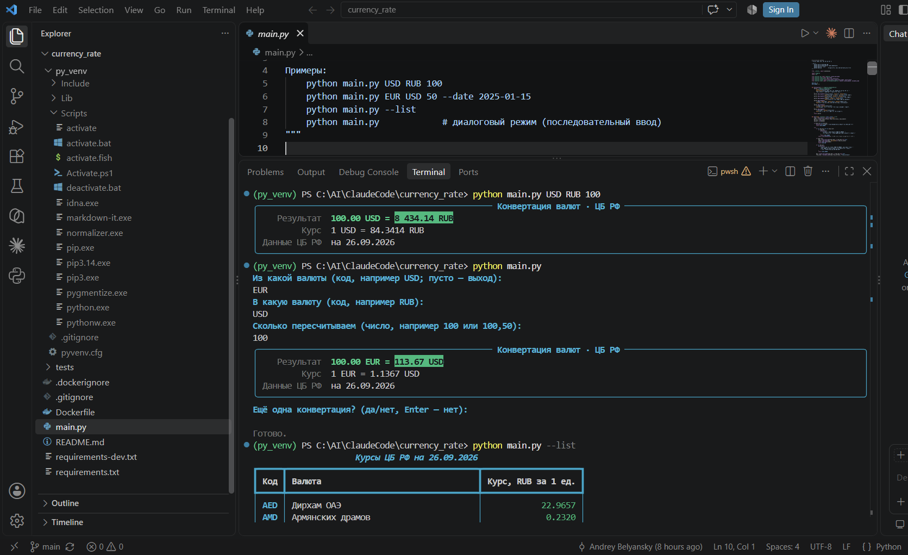

# Конвертация валют по данным ЦБ РФ

Консольная утилита на Python для конвертации валют по официальным курсам
Центрального банка РФ. Работает локально и в Docker-контейнере.

Источник данных — официальный XML-сервис ЦБ РФ
([XML_daily.asp](https://cbr.ru/scripts/XML_daily.asp),
описание: [cbr.ru/development/SXML](https://cbr.ru/development/SXML/)).

## Возможности

- Конвертация любой пары валют, включая перекрёстные курсы (например EUR → USD)
  — через рублёвые курсы ЦБ РФ.
- Диалоговый режим: запуск без аргументов → программа по очереди спрашивает
  валюты и сумму, переспрашивает при опечатках.
- Опция `--date` — курсы на конкретную дату (архив ЦБ РФ).
- Флаг `--list` — таблица курсов всех валют ЦБ РФ за 1 единицу в рублях.
- Кэш курсов на день — повторные запуски не обращаются к API ЦБ РФ.
- Вывод результата, курса за 1 единицу и даты данных ЦБ РФ.
- Зависимости: `requests` (запросы), `rich` (цветной вывод).
- Никаких ключей API не требуется.

## Установка и запуск локально

Требуется Python 3.10+.

```bash
pip install -r requirements.txt

python main.py USD RUB 100
python main.py EUR USD 50
python main.py USD RUB 100.50 --date 2025-01-15
python main.py --list
python main.py        # диалоговый режим
```

## Запуск в Docker

```bash
docker build -t currency-converter .

docker run --rm currency-converter USD RUB 100
docker run --rm currency-converter EUR USD 50 --date 2025-01-15
docker run --rm currency-converter --list

# Диалоговый режим (нужен TTY — флаг -it):
docker run -it --rm currency-converter

# С сохранением кэша между запусками (именованный том):
docker run --rm -v currency-cache:/root/.cache/currency_converter currency-converter USD RUB 100
```

## Диалоговый режим

Запуск без аргументов открывает диалог: исходная валюта → целевая валюта →
сумма → результат → «Ещё одна конвертация?». Коды можно вводить в любом
регистре, сумму — с точкой или запятой; при опечатке программа переспрашивает.

- Пустой ввод на первом вопросе или на вопросе о повторе — завершение работы.
- `Ctrl+C` — аккуратное прерывание («Прервано пользователем»).
- В Docker обязателен флаг `-it`: без него stdin пуст, программа печатает
  подсказку про `-it` и выходит с кодом 1. Режим с аргументами (`docker run
  --rm currency-converter USD RUB 100`) работает без `-it`, как раньше.

## Кэш курсов

- Расположение: `~/.cache/currency_converter` (переопределяется переменной
  окружения `CBR_CACHE_DIR`); в Docker — `/root/.cache/currency_converter`.
- Свежие курсы (без `--date`) действительны в течение дня загрузки: на следующий
  день кэш обновляется. Курсы на дату (`--date`) кэшируются бессрочно — архив
  ЦБ РФ не меняется.
- Если API ЦБ РФ недоступен, а свежего кэша нет, утилита использует устаревший
  кэш с предупреждением — продолжает работать без сети.
- `--no-cache` — принудительный запрос к ЦБ РФ в обход кэша.

## Параметры

| Параметр        | Описание                                                        |
|-----------------|-----------------------------------------------------------------|
| *без аргументов*| Диалоговый режим: последовательный ввод параметров              |
| `from_currency` | Код валюты ISO 4217, из которой конвертируем (например `USD`)   |
| `to_currency`   | Код валюты ISO 4217, в которую конвертируем (например `RUB`)    |
| `amount`        | Сумма для конвертации (разделитель — точка или запятая)         |
| `--date ГГГГ-ММ-ДД` | Курсы на дату (необязательно; по умолчанию — последние)     |
| `--list`        | Таблица курсов всех валют за 1 единицу в рублях                 |
| `--no-cache`    | Игнорировать кэш и запросить ЦБ РФ заново                       |

## Пример вывода

На скриншоте — все три режима: конвертация с аргументами, диалоговый режим
и таблица курсов `--list`:



## Обработка ошибок

- Недоступен API ЦБ РФ, сеть, таймаут → сообщение и код выхода `1`.
- Неизвестный код валюты → сообщение со списком доступных кодов.
- Неверный формат суммы, даты или кода валюты → сообщение с подсказкой.

## Структура проекта

```
├── main.py               # точка входа, CLI-аргументы, маршрутизация режимов
├── converter/
│   ├── api.py            # запрос к XML_daily.asp и разбор XML
│   ├── cache.py          # кэш курсов на день (JSON-файлы)
│   ├── rates.py          # конвертация через рубль, валидация, форматирование
│   ├── interactive.py    # диалоговый режим
│   └── output.py         # цветной вывод (rich)
├── tests/                # тесты без обращений к сети
│   ├── test_rates.py
│   ├── test_cache.py
│   └── test_interactive.py
├── requirements.txt
├── Dockerfile
└── .dockerignore
```

## Разработка

```bash
pip install -r requirements-dev.txt
pytest
```